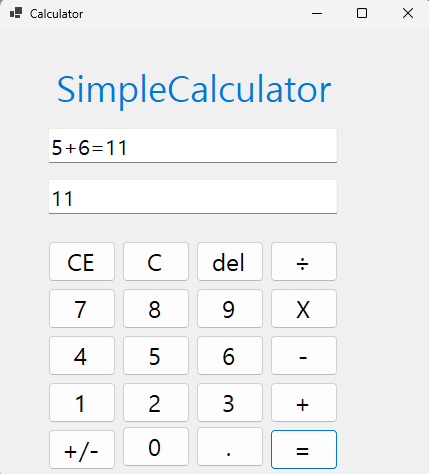
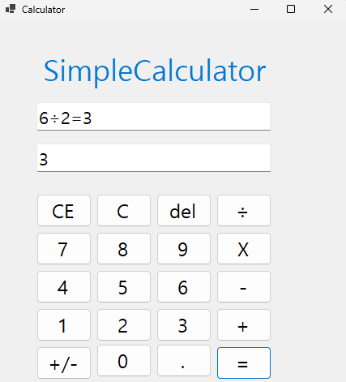
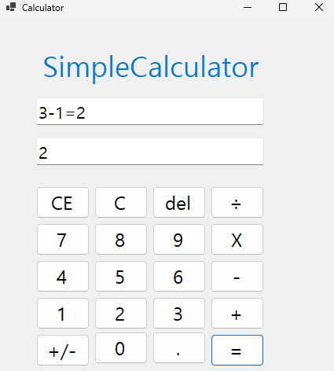
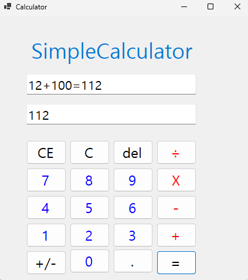
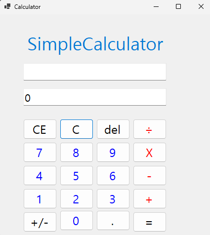
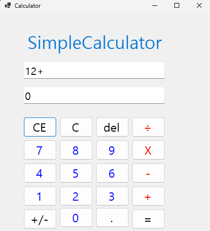
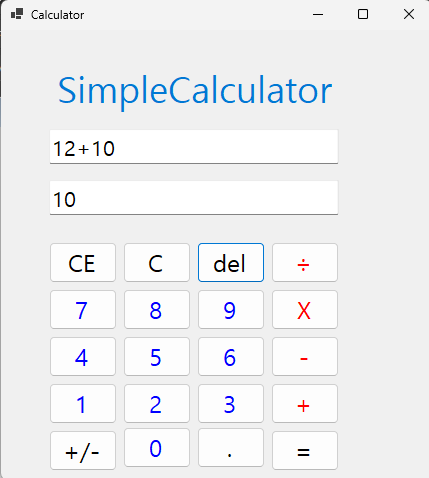

# (C# 코딩) 나만의 계산기
## 개요
-C# 프로그래밍학습
-1줄소개: 마이크로소프트 계산기와 기능이 유사한 나만의 심플한 계산기 프로그램
-사용한플랫폼: -C#, .NET Windows Forms, Visual Studio, GitHub
-사용한컨트롤:-Label, TextBox, ListBox, Button
-사용한기술과구현한기능:
-Visual Studio를이용하여UI 디자인
-숫자열과 문자열의 변환 후 계산
-숫자기호를 이용한 계산
-텍스트 박스에 서로 다른 유형으로 표시하기

## 실행화면(과제1)
-과제1코드의실행스크린샷
-과제내용
-라벨과 텍스트박스, 버튼을 추가하여 기본적인 UI를 구성했습니다
-문자변수와 숫자변수를 변환하며 계산을 수행하는 기능을 구성했습니다
-계산 결과와 계산 과정을 두가지 텍스트박스에 서로 다르게 표시하는 기능을 구현했습니다.
-더하기 기호를 인식하여 계산하는 기능을 구현했습니다

-구현내용과기능설명
-라벨과 텍스트박스,버튼을 추가하여 UI를 구성했습니다
-각 버튼마다 이벤트를 연결해서 누를시 txt.Cause에 입력되도록 했습니다
-더하기 기호, = 기호를 누를시 이를 인식해서 계산되게 구현했습니다
-txt.Cause에는 계산과정이 표시되고 txt.Result에는 계산 결과가 표시되도록 구현했습니다
-계산이 끝난후 다시 숫자버튼을 누르면 txt.Cause와 txt.Result가 초기화되도록 구현했습니다

## 실행화면(과제2)
-과제2코드의실행스크린샷
-과제2코드의실행스크린샷
-과제2코드의실행스크린샷

-과제내용
-과제1에서 구현한 계산기에 빼기, 곱하기, 나누기 기능을 추가했습니다
-빼기,곱하기,나누기 버튼은 과제1에서 이미 추가 했습니다.
-각 버튼마다 이벤트를 연결해서 누를시 txt.Cause에 입력되도록 했습니다
-더하기, 빼기, 곱하기, 나누기 기호, = 기호를 누를시 이를 인식해서 계산되게 구현했습니다
-txt.Resulㅅ 에서도 이벤트를 연결해서 결과값이 계산되어 나오게 했습니다

-구현내용과기능설명
-빼기,곱하기,나누기 버튼은 과제1에서 이미 추가 했습니다.
-각 버튼마다 이벤트를 추가 후 더하기 기호, 빼기 기호, 곱하기 기호, 나누기 기호, = 기호를 누를시 이를 인식해서 계산되게 구현했습니다
-각 버튼 계산시 더하기와 동일한 로직으로 계산되도록 했습니다.
-txt.Cause 에서 빼기,곱하기,나누기 버튼으로도 계산이 되고 계산결과까지 나오도록 구현했습니다
-txt.Result 에서도 이벤트를 연결해서 결과값이 계산되어 나오게 했습니다

## 실행화면(과제3)
-과제3코드의실행스크린샷
-과제3코드의실행스크린샷
-과제3코드의실행스크린샷
-과제3코드의실행스크린샷

-과제내용
-계산기에있는수정/삭제기능구현
-C버튼 = 현재의모든내용을삭제하고처음(초기화된) 상태로되돌아감
-CE 버튼 = 마지막입력한피연산자(Operand) 값을삭제함,100 입력후에 CE 눌렀다면100 값이통째로삭제됨
-del 버튼 = 100 입력후에Del 눌렀다면10 으로변경됨

-구현내용과기능설명
-계산기에 숫자와 기호를 구분하기 쉽게 색을 다르게 했습니다
-C 버튼 = 현재 입력된 모든 숫자, 누적된 연산 결과, 기록 창(txt_Cause 및 txt_Result)을 모두 삭제하고 프로그램을 처음 실행한(초기화된) 상태로 되돌립니다.
-CE 버튼 = 전체 수식을 지우지 않고 가장 마지막에 입력 중이던 숫자(피연산자)만 삭제합니다. 기록 창(txt_Cause)에서도 방금 입력하던 부분만 삭제해 입력을 다시 할 수 있게 합니다
-del 버튼 = 현재 입력 중인 숫자의 마지막 한 글자만 지워주는 기능입니다. (예: 100을 입력 중 한 번 누르면 10이 되고, 기록 창에서도 한 글자가 지워집니다.) 글자를 모두 지우면 기본값인 '0'으로 변경됩니다.
